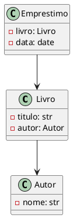

# Aula 07 – Relações UML e Modelagem

## Explicação Conceitual
- Diagramas de classes UML
- Representação de herança, composição e agregação
- Ferramentas para modelagem

### UML
Explique o que é UML, principais diagramas, foco em diagrama de classes.

### Relações
Demonstre como representar herança, composição e agregação em UML.

## Prática com Exemplos
- Desenhe diagramas de classes para exemplos das aulas anteriores.
- Sugira uso de ferramentas como draw.io, Lucidchart ou PlantUML.

## Exercícios
1. Modele em UML um sistema de biblioteca com Livros, Autores e Empréstimos.
2. Represente as relações entre as classes usando UML.

## Resolução dos Exercícios
- Apresente um diagrama de classes UML (desenho ou PlantUML):

